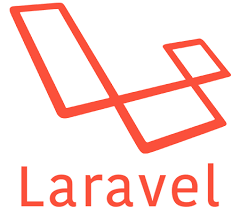

<!-- BLOG-POST-LIST:START -->
### What's up! 👋

Welcome to my profile. I'm Mootassam working currently as a Full Stack Developer.

<!-- BLOG-POST-LIST:START -->
<!-- BLOG-POST-LIST:START -->

### Tech Stack

           
        

<!-- BLOG-POST-LIST:START -->

-->
